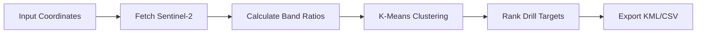

# Quick Start Guide - Mineral Exploration Satellite Analysis

## 🚀 Project Overview

**What is this?** AI-powered drill target generation for junior mining companies using free Sentinel-2 satellite data.

**Business Value:** $350k exploration cost savings (70% reduction)

**Region:** Chile's IV Region (Coquimbo/La Serena - Andacollo Copper District)

---

## ⚡ 5-Minute Local Setup

### Step 1: Clone & Install

```bash
cd c:\Users\julie\.gemini\proyecto_mineria
pip install -r requirements.txt
```

### Step 2: Authenticate Google Earth Engine

```bash
# One-time authentication
earthengine authenticate
```

This will open a browser to authorize your Google account with Earth Engine.

### Step 3: Run the App

```bash
streamlit run app.py
```

The app will open at `http://localhost:8501`

### Step 4: Generate Drill Targets

1. **Use default coordinates** (Andacollo: -30.226, -71.078)
2. Click **"GENERATE DRILL TARGETS"**
3. Wait 30-60 seconds
4. View results on interactive map
5. Download CSV/KML for QGIS

---

## 📁 Project Files

```
proyecto_mineria/
├── app.py                    # Main Streamlit dashboard ⭐
├── analysis_engine.py        # GEE processing & ML clustering
├── requirements.txt          # Dependencies
├── .streamlit/
│   └── config.toml          # UI theme
├── data/
│   └── sample_output.csv    # Sample drill targets
├── README.md                 # Portfolio documentation
├── deployment.md             # Streamlit Cloud guide
├── exploration_report.md     # Executive summary template
└── .gitignore               # Git ignore rules
```

---

## 🛰️ How It Works

### Data Source
- **Sentinel-2** satellite (free, Copernicus/ESA)
- **10-60m resolution** multispectral imagery
- **5-day revisit** time (global coverage)

### Analysis Workflow



### Band Ratios

1. **Iron Oxide Index**  
   `(B4 - B2) / (B4 + B2)`  
   Detects: Gossans, oxidized zones

2. **Clay Minerals**  
   `B11 / B12`  
   Detects: Argillic alteration

3. **Vegetation Mask**  
   `(B8 - B4) / (B8 + B4)`  
   Excludes: False positives from vegetation

### Machine Learning

- **K-Means clustering** (4 clusters)
- **Confidence scoring** (0-100%)
- **Priority ranking:** High → Medium → Low

---

## 📊 Expected Output

### Drill Target Table

| Rank | Lat | Lon | Confidence | Alteration | Priority |
|------|-----|-----|------------|------------|----------|
| 1 | -30.2234 | -71.0812 | 87.3% | Mixed | High |
| 2 | -30.2189 | -71.0745 | 82.1% | Iron Oxide | High |
| 3 | -30.2301 | -71.0891 | 76.5% | Clay | Medium |

### Key Metrics

- 📏 Total area analyzed: 314 km²
- 🔴 High-priority zones: 4.2 km²
- 🎯 Drill targets: 5
- 💰 Estimated savings: $350,000

---

## 🌐 Deployment to Streamlit Cloud

See **[deployment.md](deployment.md)** for complete guide.

**Quick Steps:**
1. Push to GitHub
2. Sign up at [share.streamlit.io](https://share.streamlit.io)
3. Add GEE credentials to secrets
4. Deploy!

**Expected URL:** `https://yourusername-proyecto-mineria-app.streamlit.app`

---

## 🎯 Use Cases for Portfolio

### 1. **Junior Mining Companies**
   - TSX-V/ASX listed explorers
   - Target: Reduce drilling risk
   - Pitch: Data-driven exploration

### 2. **Remote Sensing Consultants**
   - Service offering: Custom alteration mapping
   - Regions: Chile, Peru, Nevada, BC
   - Deliverable: Executive reports

### 3. **Data Science Portfolio**
   - Demonstrates: GEE API, ML, geospatial viz
   - Business focus: Real ROI calculations
   - Deployable: Live Streamlit app

---

## 🔧 Customization

### Change Analysis Region

```python
# In app.py, update default coordinates
latitude = st.sidebar.number_input(
    "Latitude (°)",
    value=-30.226,  # Change to your region
    ...
)
```

### Adjust Clustering Parameters

```python
# In analysis_engine.py
n_clusters = 4  # Change to 3-6 clusters
ndvi_threshold = 0.3  # Lower for more vegetation tolerance
```

### Export Additional Formats

```python
# Add to app.py
# GeoJSON export
import geopandas as gpd
gdf = gpd.GeoDataFrame(drill_targets, geometry=...)
gdf.to_file("targets.geojson", driver='GeoJSON')
```

---

## ❓ Troubleshooting

### "GEE Authentication Failed"

**Solution:**
```bash
earthengine authenticate
```

### "No imagery found"

**Causes:**
- Too strict cloud cover filter (try 30% instead of 20%)
- No Sentinel-2 data for date range (try larger window)
- Location outside Sentinel-2 coverage (very rare)

### Slow Performance

**Optimization:**
- Reduce radius (10 km → 5 km)
- Use 60m resolution (already default)
- Increase cloud cover tolerance

---

## 📞 Contact

**Author:** Julie Gaete  
**Email:** juliegaeteguzman@gmail.com  
**LinkedIn:** [linkedin.com/in/juliegaete](https://linkedin.com/in/juliegaete)

---

## 📚 Additional Resources

- **Google Earth Engine:** [earthengine.google.com](https://earthengine.google.com)
- **Sentinel-2 Specs:** [sentinel.esa.int](https://sentinel.esa.int/web/sentinel/missions/sentinel-2)
- **Streamlit Docs:** [docs.streamlit.io](https://docs.streamlit.io)
- **Chilean Geology:** [sernageomin.cl](http://www.sernageomin.cl/)

---

<div align="center">

**🎓 Portfolio Project | 💼 ROI-Focused | 🛰️ Satellite + AI**

*Built for junior mining executives who need data-driven exploration*

</div>
